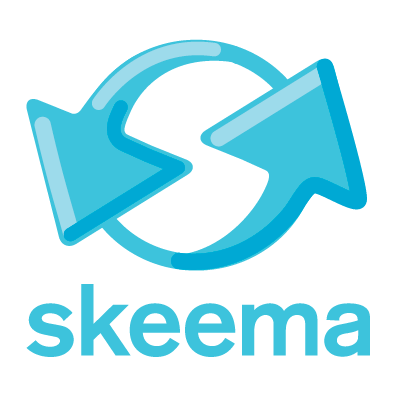
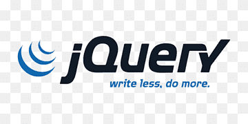
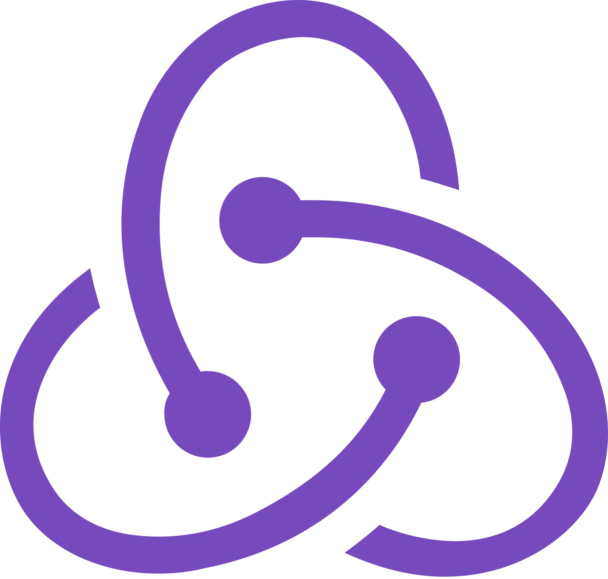
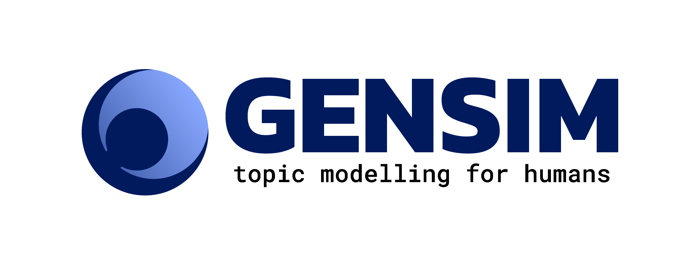

 
  
# Recent Highlights

🚀 Our first self-hosted website is on the way!

🎉 We just launched a new Technology team at New York Chapter 🗽

⭐ New positions available for [**Global Branding and Design Manager**](https://opps.bridgesforenterprise.com/technology), etc (TBD)

⭐ New projects available for [**DevOps**](https://opps.bridgesforenterprise.com/technology), etc (TBD)

 

Sign up for our [**latest projects and roles**](https://opps.bridgesforenterprise.com/technology) or [**email us**](mailto:technology@bridgesforenterprise.com) about how you want to get involved today! 

 
 

 

 

 
 
 

  <h2> Who we are </h2>
  

[Bridges for Enterprise (BfE)](https://www.bridgesforenterprise.com) is a global non-profit that provides pro-bono advisory services to social impact startups in the developing world.

At BfE Technology, we build algorithms and products to connect our global community and make our services accessible to all. 

We are a group of passionate professionals and students from all over the world, who care deeply about pursuing professional growth while creating a lasting social impact beyond our day-to-day work. 

  

 
 
 

     
## Any technology discipline from anywhere in the world

We leverage on a wide variety of technological solutions to address vital needs of the organisation.

     

    

      

        

          
Data Analytics

          
        

        

          
Discover insights from our large influx of structured and unstructured data, and propose solutions to improve our strategies and operational models

        

      

    
      
    

      

        

          
Web & App Dev

          
        

        

          
Develop new features, tools and apps as part of BfE's growing digital platform, connecting our global user base and making our resources more widely accessible

        

      

    
      
    

      

        

          
ML & Algo

          
        

        

          
Design and implement advanced algorithms and machine learning tools to automate some of the most complex decision-making processes in BfE

        

      

    
  
    

      

        

          
DevOps

          
        

        

          
Design and maintain a robust set of development toolkit and integration pipelines to ensure smooth delivery of our applications

        

      

    
       
    

      

        

          
Product Management

          
        

        

          
Be the glue that brings different parts of tech together, lead feature ideation and lay out the roadmap for execution

        

      

    

    

      

        

          
Cyber Security

          
        

        

          
Examine and maintain our tech stack to identify and patch critical security loopholes, while working with DataOps and our legal advisor to ensure compliance with data protection regulations

        

      

    
 
    

      

        

          
DataOps

          
        

        

          
Oversee the design and maintainence of our internal database, and work with global leadership to establish operational procedures that may alter the database

        

      

    
 
    

      

        

          
Branding & Design

          
        

        

          
Oversee branding strategies and guidelines for all types of digital media under the Outreach division, while converting them into standardised stylesheets to be imposed across the Technology Division

        

      

    
 
    

      

        

          
Technical Advisory

          
        

        

          
Oversee the Technical Advisory programme within Incubation, while working with the Technology Division to host joint technical trainings

        

      

    
 

  

 
If there is anything you want to contribute that is not listed here and yet would be a great fit for us, let us know! ;)
 

  
   
   
  <h2 style="text-align: center;">Tech Stack</h2>
  

     
   
       
       
       
       
       
       
       
       
       
       
       
       
       
       
       
       
       
       
     

       
     
We also manage automations on platforms such as

       
     
  
       
       
       
       
     

       
     
We are always looking for new tools that can improve our work. Currently, we are actively looking for developers with experience including but not limited to

       
     
  
       
       
       
       
       
     

       
     
If you are looking to join our Technical Advisory team to help our startups, they cover a much broader spectrum of work from <strong>app development</strong> to <strong>blockchain</strong> and <strong>machine learning</strong> - in short, there is almost always something for you! 

       
       
       
  

 

## Exciting technical challenges for all experience levels

Whether you are looking to pick up new tools or challenge yourself with advanced problems, at BfE Technology, your learning transforms into tangible outcomes that impact real businesses around the world.

 

    

      

        

                    
          
Beginner

        

        

          

            Join our student teams to start your journey with 
            <ul>
              <li>Data Analytics,</li>
              <li>Machine Learning and Algorithm, and/or</li>
              <li>Software Development,</li>
            </ul>
            with our wide variety of projects, training workshops, reading groups and external talks. 
          

        

      

    
      
    

      

        

          
          
Intermediate to Advanced

        

        

          

            Sharpen your skills and make an impact as a
            <ul>
              <li>Global Tech Volunteer for web dev, algo, DevOps and cloud,</li>
              <li>Project Tech Lead,</li>
              <li>Technical Advisory for our startups,</li>
              <li>Presenter at our workshops and talks, and/or</li>
              <li><a href="https://www.bridgesforenterprise.com/professionals">Professional Technology Mentor.</a></li>
            </ul>
          

        

      

    
      
    

      

        

          
          
No coding

        

        

          

            Contribute your unique set of skills to our technology team via
            <ul>
              <li>Business Analytics,</li>
              <li>Product Management,</li>
              <li>Partnerships, </li>
              <li>Branding and Design, </li>
              <li>and anything you can think of!</li>
            </ul>
          

        

      

    
      
  

 
 

   
  <h2 style="text-align:center">Inspire • Invent • Impact</h2>
  

    We design software, analytics and algorithmic solutions addressing the most vital issues in scaling the organisation for an ever-growing user base worldwide.
  

  

    some fancy stats
  

     
     

 

## A global network passionate about social impact, startups and technology
  
Be part of a global community that cares deeply about empowering early-stage social enterprises with our professional skills. 

Our students and professionals come from **consulting**, **finance**, **legal** and **technology** backgrounds, covering a broad spectrum of knowledge and experiences and are found [**across the globe**](https://www.bridgesforenterprise.com).

Our startups work in a diverse range of sectors. Read more about our in-house case studies [**here**](https://www.bridgesforenterprise.com/our-impact/case-studies/), or check out how some of them harness **cutting-edge technology** to scale their impact below.

  

    
<iframe src="https://www.youtube.com/embed/-yFCinGjxeM?start=42&modestbranding=1&cc_lang_pref=en&cc_load_policy=1" frameborder="0" allow="accelerometer; autoplay; clipboard-write; encrypted-media; gyroscope; picture-in-picture" allowfullscreen=""></iframe>

    
 
      <h2>ARED</h2>
      

        PaaS internet service and applications provider via solar powered kiosks
        <a href="http://www.a-r-e-d.com/" target="_blank"><i class="fas fa-link"></i></a>
      

      

          <ul>
            <li>Provides digital access through mini servers, portable solar kiosks and an in-house mobile app to 6 countries across Africa</li>
            <li>Recipient of numerous awards including <a href="https://microsoftcaregh.com/2019/07/25/a-solar-powered-mobile-digital-kiosk-that-empowers-women-across-rwanda/" target="_blank">Microsoft's affordable Access Initiative grant</a> and <a href="https://africa50innovationchallenge.com/solutions/" target="_blank">Special Recognition Award at Africa 50 Innovation Challenge</a> </li>
            <li>Read <a href="https://techpoint.africa/2020/01/09/ared-profile/" target="_blank">an Techpoint Africa article about the startup</a>, where they raised 500K USD as of Jan 2020 and are on track to even more rapid expansion</li>
          </ul>
      

    

  

  

    
<iframe src="https://www.youtube.com/embed/ektz966A188?modestbranding=1&cc_lang_pref=en&cc_load_policy=1" frameborder="0" allow="accelerometer; autoplay; clipboard-write; encrypted-media; gyroscope; picture-in-picture" allowfullscreen></iframe>

    
 
      <h2>BAG Innovation</h2>
      

        Gamified and AI-based digital learning platform for African youth 
        <a href="https://bag.rw/" target="_blank"><i class="fas fa-link"></i></a>
      

      

          <ul>
            <li>Gamification platform built by former Candy Crush developers</li>
            <li>Raised USD 150K in <a href="https://disrupt-africa.com/2019/10/21/rwandan-ed-tech-startup-bag-innovation-raises-150k-seed-round" target="_blank">seed round</a>, and <a href="https://www.newtimes.co.rw/news/rwandan-duo-wins-over-rwf100-million-innovation-award" target="_blank">joint winner of Make-IT in Africa's contest</a> with an award of approx. 100K in USD </li>
            <li><a href="https://www.cnbcafrica.com/2020/rwandan-start-ups-win-over-rwf100mn-innovation-award/" target="_blank">Interview with CNBC Africa</a></li>
          </ul>
      

    

  

  

    
<iframe width="560" height="315" src="https://www.youtube.com/embed/ud__YBJjKxU?start=47&modestbranding=1&cc_lang_pref=en&cc_load_policy=1" frameborder="0" allow="accelerometer; autoplay; clipboard-write; encrypted-media; gyroscope; picture-in-picture" allowfullscreen></iframe>

    
 
      <h2>Beat Drone</h2>
      

        Nigerian drone service provider 
        <a href="http://www.beatdrone.co/" target="_blank"><i class="fas fa-link"></i></a>
      

      

          <ul>
            <li>Provide drone services to businesses and governments <a href="http://beatdrone.co/blog/" target="_blank">across sectors</a> such as agriculture, warehouse inventory and construction</li>
            <li>Helped local government and farmers in the fight against COVID-19 by <a href="https://disrupt-africa.com/2020/04/20/nigerian-startup-beat-drone-spraying-disinfectant-to-fight-covid-19/" target="_blank">using drones to spray agricultural disinfectants</a></li>
            <li>Featured in a <a href="https://www.youtube.com/watch?v=ud__YBJjKxU" target="_blank">2-minute news clip by TRT World</a></li>
          </ul>
      

    

  

  

    
<iframe src="https://www.youtube.com/embed/324XsWmpv8I?modestbranding=1&cc_lang_pref=en&cc_load_policy=1" frameborder="0" allow="accelerometer; autoplay; clipboard-write; encrypted-media; gyroscope; picture-in-picture" allowfullscreen></iframe>

    
 
      <h2>Coronet Blockchain</h2>
      

        South African blockchain-based hair product supply chain solutions from ethical global manufacturers
        <a href="https://www.coronetblockchain.com/" target="_blank"><i class="fas fa-link"></i></a>
      

      

          <ul>
            <li>End-to-end supply chain management built on IBM blockchain</li>
            <li><a href="https://www.lionessesofafrica.com/blog/2020/6/28/startup-story-of-pretty-kubyane" target="_blank">Interview with Lionesses of Africa</a></li>
          </ul>
      

    

  

  

    
<iframe src="https://www.youtube.com/embed/BWkMiNHI57o?modestbranding=1&cc_lang_pref=en&cc_load_policy=1" frameborder="0" allow="accelerometer; autoplay; clipboard-write; encrypted-media; gyroscope; picture-in-picture" allowfullscreen></iframe>

    
 
      <h2>Farming Data</h2>
      

        Colombia-based agricultural produce digital trading platform
        <a href="https://farmingdata.io/" target="_blank"><i class="fas fa-link"></i></a>
      

      

          <ul>
            <li>Founded and advised by PhDs and researchers from University of Cambridge; see an <a href="https://www.youtube.com/watch?v=BWkMiNHI57o">interview with the team</a></li>
            <li>Won <a href="https://www.gatescambridge.org/about/news/alumna-leads-international-consortium-for-smallholders-in-colombia/">approx. 445K USD funding</a> from Innovate UK Grant and backed by <a href="https://farmingdata.io/about/" target="_blank">Cambridge Judge Business School and the UK Prosperity Fund, among others</a></li>
            <li>Check out <a href="https://youtu.be/PhPvHw6VKWE" target="_blank">the latest video</a> of their flagship trading app, Listo (the video is in Spanish with auto-translated subtitle available)</li>
          </ul>
      

    

  

           

 

 

<h2>Join us today</h2>

Our student projects are organised by our student chapters at the start of their academic term. We also have projects under the global team open year-round to students and professionals at various experience levels. The commitment levels are designed to take into account your full-time study/work schedule and will be specified in each project.

We are also actively seeking experienced students or professionals to fill some vacancies in the global technology leadership team or to join our global mentor network. The commitment level for global leadership roles is typically less than a project, but depends on the actual responsibilities assigned and your personal interest. The commitment level for mentors is highly negotiable; you may choose to join our network first, and commit only when there are questions from students pertaining to your area of expertise and when you are free.

Browse our open roles and projects now at <a href="https://opps.bridgesforenterprise.com/technology/">this page</a>. For mentorship applications, you may check out our <a href="https://www.bridgesforenterprise.com">main website</a> or email technology@bridgesforenterprise.com to find out more.  

### If you need more convincing...

"How is joining BfE Tech any different from other tech projects available at university and work?"

**We are startup-like.** We are a new division within BfE, meaning that there are plenty of opportunities to apply technology that hasn't been explored within the organisation. You can wear many hats! If you have an idea about what you want to do in BfE, we will provide you with the resources to fulfil it.

**We are established.** Founded in 2015, BfE has established an extensive network of students, professionals and entrepreneurs around the world, allowing you to make many meaningful connections and even forge new partnerships on behalf of BfE Technology. We have a wide range of talent and connections within BfE Technology from experienced undergraduates to PhDs, full-time professionals and tech consulting firms; everyone is here for you to bounce ideas off and get advice regarding BfE or non-BfE work. At the moment, we are working hard to develop training materials to consolidate our experience and pass on the knowledge to new members.

**We are local.** Our student chapters organise many in-person events and meetups to engage you with BfE members and mentors from a wide spectrum of backgrounds, enabling you to build connections within your geographical region. We are currently based in the UK, Singapore, the US, the Netherlands and Canada - and actively expanding our footprint across the world.

**We are global.** We have many global virtual events and updates keeping everyone informed of the ongoings in BfE and allowing you to connect to people in places you have never been before. Most of our tech work is done via online collaboration, so there is no geographical limitation regarding where you should be.

**We are secure. ** As we work with many different stakeholders and handle sensitive data, we are very careful about ensuring data protection and security in every aspect of our code. Before making it fast, we first make it work and make it right.

**We are adventurous.** We never shy away from learning and approving new technologies to improve the way we code and analyse things at BfE. BfE was founded on the belief that the better we are at our work, the greater the impact we have for our startups, students and mentors. This belief underpins our thirst for innovation within BfE Technology.

**We are impact-minded.** Unlike most university projects and hackathons, the code you write for BfE will directly address real business needs both internally and for our stakeholders, including real companies accessing BfE's resources and advice, making an instant, tangible social impact on a global scale.

**We go above and beyond.** Unlike doing a corporate job, everyone is involved in BfE on a voluntary basis, meaning that we are not here to be a small cog in a big machine and focus just on our small bit of code, but to take ownership and enact changes we believe will better serve our cause. We also echo with the principle of open-source code, and whenever we can (that is, without compromising the security of our users' data), we encourage you to open-source a modified version of the code you have done in BfE as our way to give back to the tech community.

Featured project:
- Some of the cool data we have looked at include startup application data, crowdfunding data and web traffic data for SEO optimisation.
- While some of us use NLP tools to help recommend investors for a given startup, others are looking at startup-mentor matching formulated as a graph matching problem, or advising the development of a voting system for startup selection. If you see a bunch of people arguing over maths on a whiteboard or getting all hyped about a new ML library in Python, that is us!
