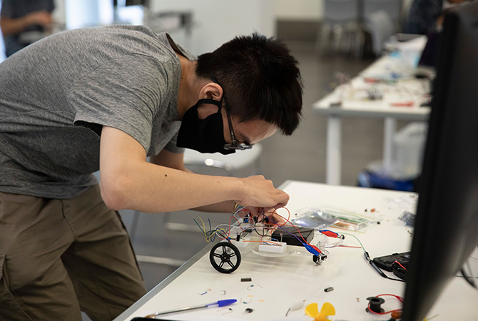
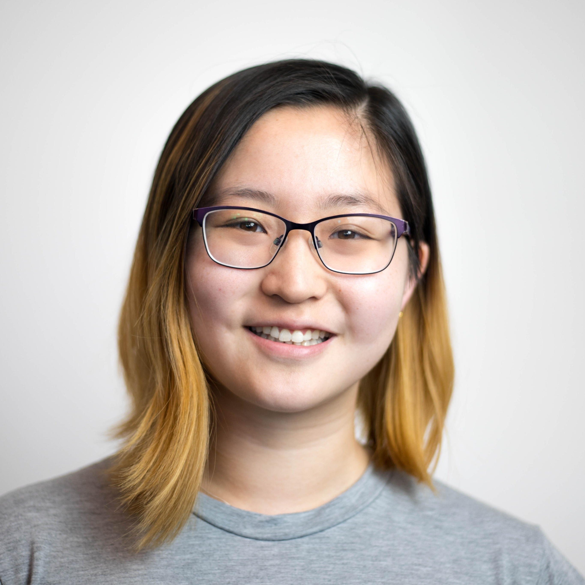
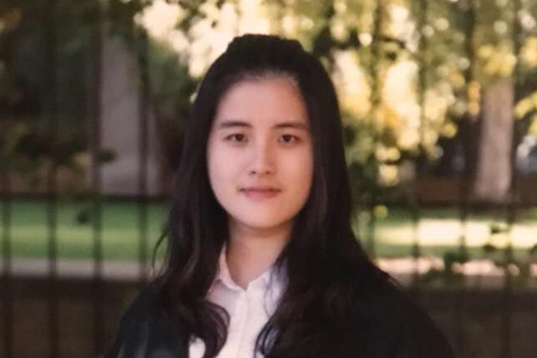
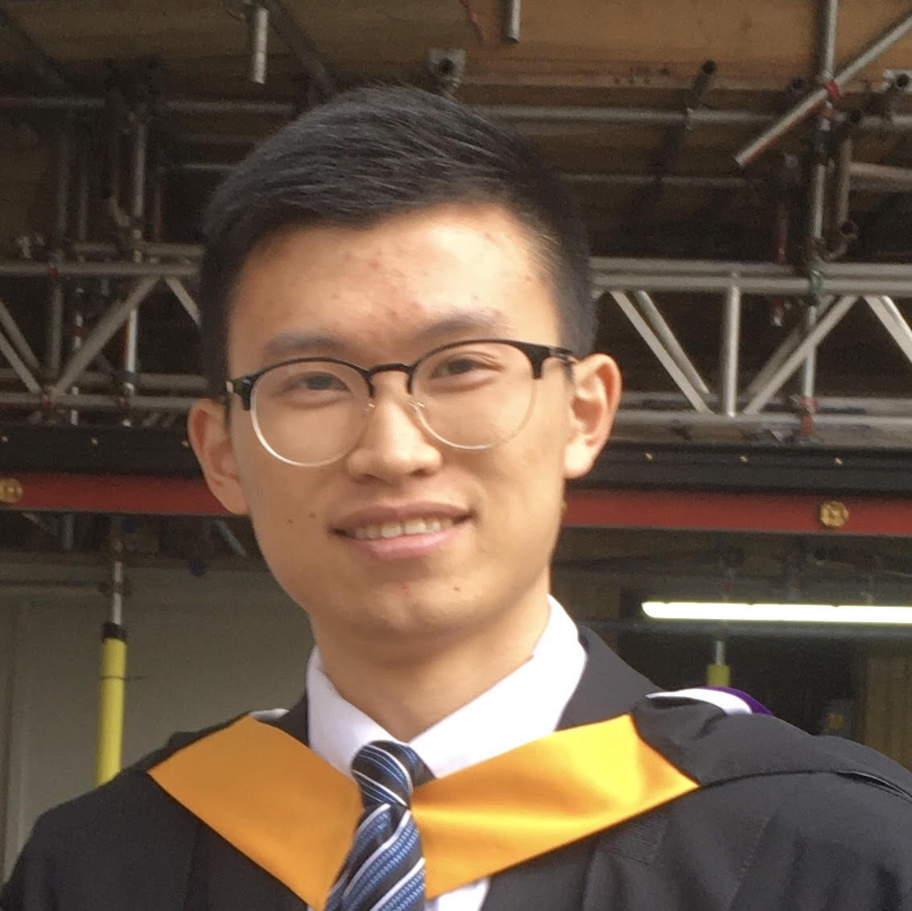
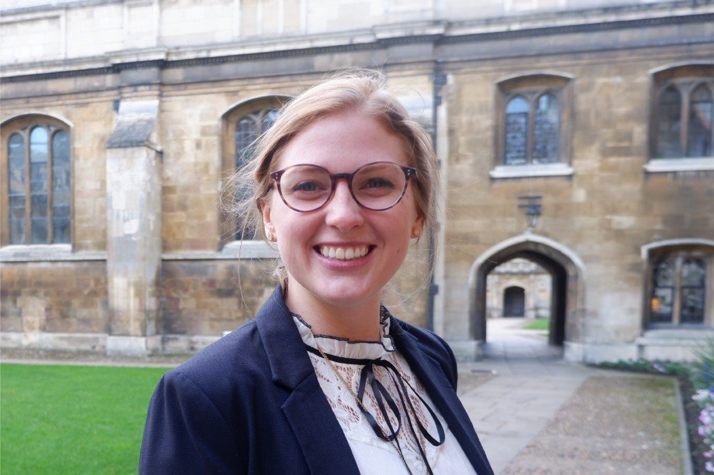
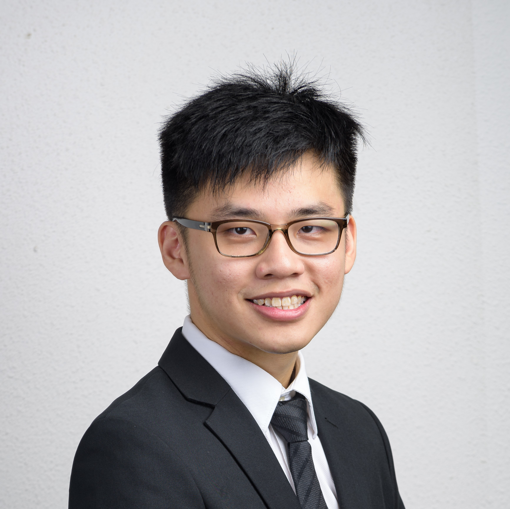
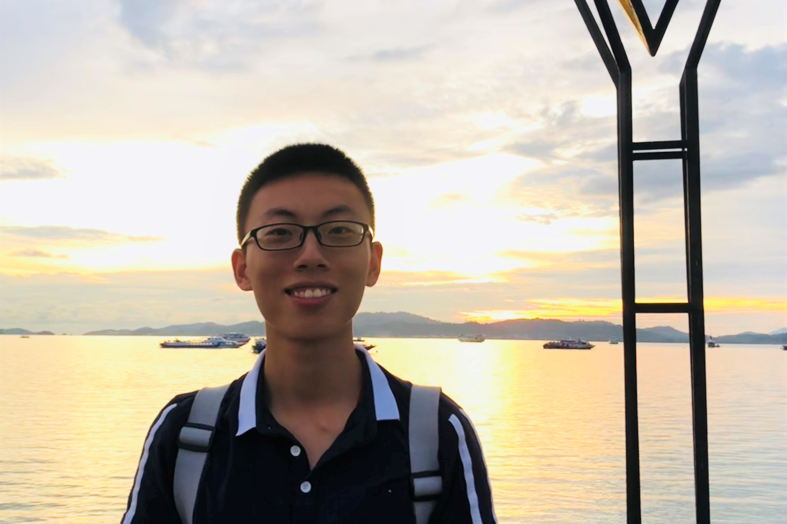
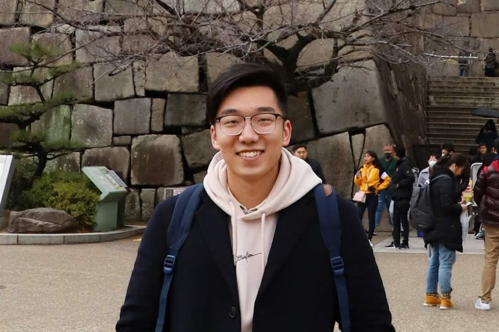

 
  
<h2> Mentors </h2>

<small>Only mentors directly advising our Global Management Team are listed here.</small>

<h2> Management Team </h2>

   

     
     

       <h4 class="team-name">Kevin Huang</h4>
       
Head of Technology

       
<i class="fas fa-map-marker-alt"></i>London, United Kingdom

       

          PhD student in Theoretical Machine Learning, Gatsby Unit, UCL
           
          MMath and BA in Mathematics, University of Cambridge
       

       
<a href="https://www.linkedin.com/in/kevin-han-huang-995ab1a0/" target="_blank"><i class="fa fa-linkedin-in"></i></a>

     

   

   

     
     

       <h4 class="team-name">Wendi Fan</h4>
       
Software Development Manager

       
<i class="fas fa-map-marker-alt"></i>London, United Kingdom

       

         Software Developer, Softwire
          
         BA in Mathematics, Univesrity of Cambridge
       

       
<a href="https://www.linkedin.com/in/wendi-fan-150b08113/" target="_blank"><i class="fa fa-linkedin-in"></i></a>

     

   

   

     
     

       <h4 class="team-name">Olivia Hu</h4>
       
DataOps Manager

       
<i class="fas fa-map-marker-alt"></i>London, United Kingdom

       

         Imaging Scientist / Geophysicist, CGG
          
         Master in Natural Sceience and BA in Mathematics, Univesrity of Cambridge
       

       
<a href="https://www.linkedin.com/in/xuezi-hu-b11421184/" target="_blank"><i class="fa fa-linkedin-in"></i></a>

     

   

   

     
     

       <h4 class="team-name">Xing Liu</h4>
       
Analytics and Algorithm Manager

       
<i class="fas fa-map-marker-alt"></i>London, United Kingdom

       

         PhD student in statistics and machine learning, Imperial College London
          
         Master in Mathematics, Univesrity of Cambridge
          
         BA in Mathematics, Imperial College London
       

       
<a href="https://www.linkedin.com/in/xingliu97/" target="_blank"><i class="fa fa-linkedin-in"></i></a>

     

   

   

     
     

       <h4 class="team-name">Brittany Howell</h4>
       
Technology Strategies Manager

       
<i class="fas fa-map-marker-alt"></i>Cambridge, United Kingdom

       

         PhD student in Quantitative Genetics, Wellcome Sanger Institute, University of Cambridge
          
         Bachelor and Masters in Genetics and Immunology, University of Adelaide
       

       
<a href="https://www.linkedin.com/in/brittanychowell/" target="_blank"><i class="fa fa-linkedin-in"></i></a>

     

   

   

     
     

       <h4 class="team-name">Zhong Jun Hsu</h4>
       
Technology Initiatives Manager

       
<i class="fas fa-map-marker-alt"></i>Singapore

       

         Undergraduate student in Computer Science, National University of Singapore
       

       
<a href="https://www.linkedin.com/in/hsuzhongjun/" target="_blank"><i class="fa fa-linkedin-in"></i></a>

     

   

<h2> Technical Advisors </h2>

<h2> Student Chapter Team </h2>

   

     
     

       <h4 class="team-name">Jiaxiang Yu</h4>
       
Singapore Technology Director (Internal Technology)

       
<i class="fas fa-map-marker-alt"></i>Singapore

       

         Undergraduate student in Computer Science, National University of Singapore
       

       
<a href="https://www.linkedin.com/in/jiaxiang-yu/" target="_blank"><i class="fa fa-linkedin-in"></i></a>

     

   

   

     
     

       <h4 class="team-name">Xin Zhe</h4>
       
Singapore Technology Director (Technical Advisory)

       
<i class="fas fa-map-marker-alt"></i>Singapore

       

         Undergraduate student in Computer Science with Statistics, National University of Singapore
       

       
<a href="https://www.linkedin.com/in/xin-zhe-b2088a187/" target="_blank"><i class="fa fa-linkedin-in"></i></a>

     

   

<h2> Alum </h2>

